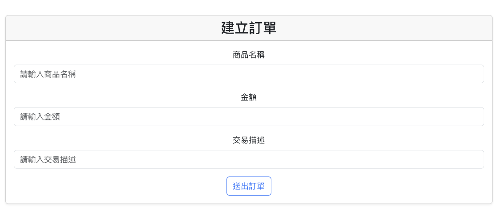
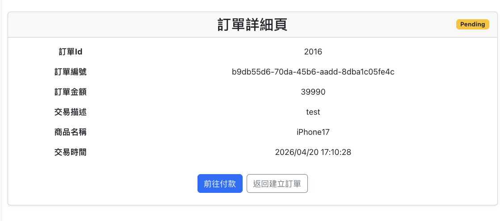
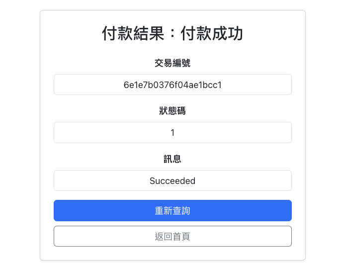

# EcpayConnection

本專案實作 **綠界金流信用卡一次付清** 串接，包含前端付款流程與後端訂單處理。
使用者可從前端建立訂單，導向綠界付款，並於付款完成後更新訂單狀態。

## 系統架構

```text
Frontend → Backend → ECPay → Backend (Callback) → Database
```

---

## Frontend

### 技術

- React 19
- React Hooks（useState、useEffect）
- React Router
- Fetch API

### UI / 樣式

- Bootstrap（版型與 UI 樣式）

### 功能

1. 使用者輸入訂單資料並建立訂單
2. 前端呼叫後端 API 建立訂單
3. 顯示訂單詳細資訊
4. 點擊付款後呼叫付款 API
5. 動態建立表單並 POST 至綠界付款頁面
   
   
   

### 如何執行

```bash
cd frontend/Ecpay-frontend
npm install
npm run dev
```

---

## Backend

### 技術

- ASP.NET MVC
- C#

### 功能

1. 建立訂單
2. 產生交易參數
3. 計算 CheckMacValue
4. 接收付款結果
5. 更新訂單狀態

### 環境設定

測試資料可參考 [綠界官網](https://developers.ecpay.com.tw/2856/)

```json
"EcpaySetting": {
  "MerchantID": "",
  "HashKey": "",
  "HashIV": "",
  "CheckoutUrl": "",
  "ReturnURL": "https://unchoosable-counteractively-henry.ngrok-free.dev/api/Payment/Return",
  "OrderResultURL": "https://unchoosable-counteractively-henry.ngrok-free.dev/api/Payment/Result",
  "ClientBackURL": "https://unchoosable-counteractively-henry.ngrok-free.dev/"
},
"ConnectionStrings": {
  "Ecpay": "資料庫連線"
}
```

### 如何執行

```bash
dotnet run
```

### 使用 ngrok

```bash
ngrok http 5170
```
